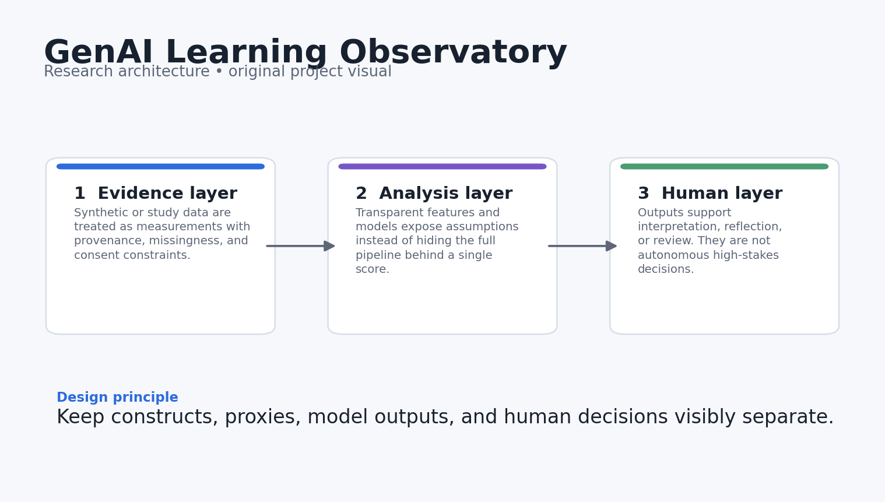
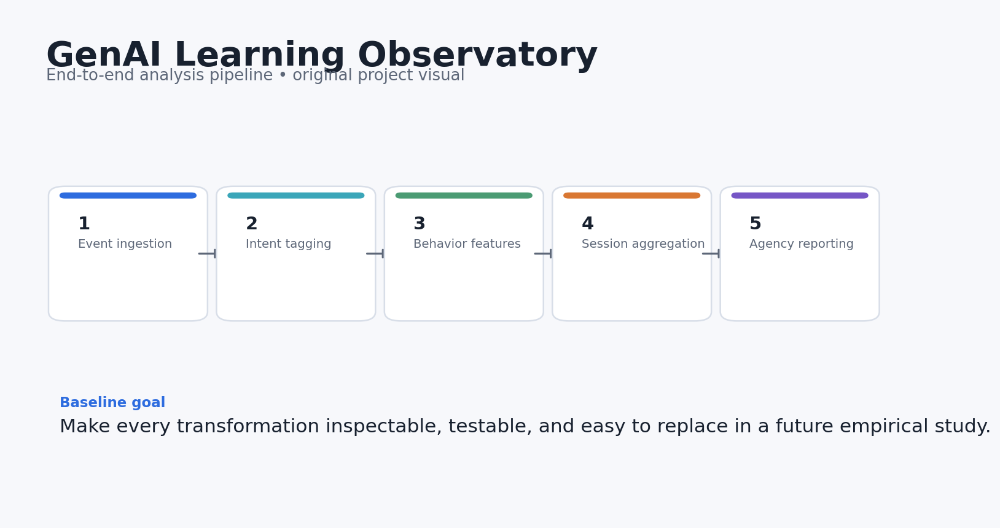
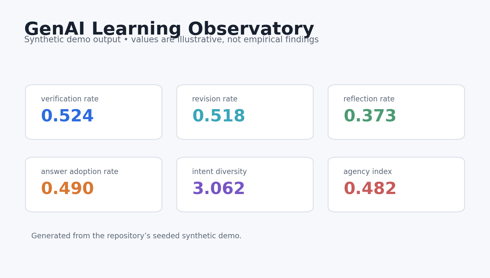
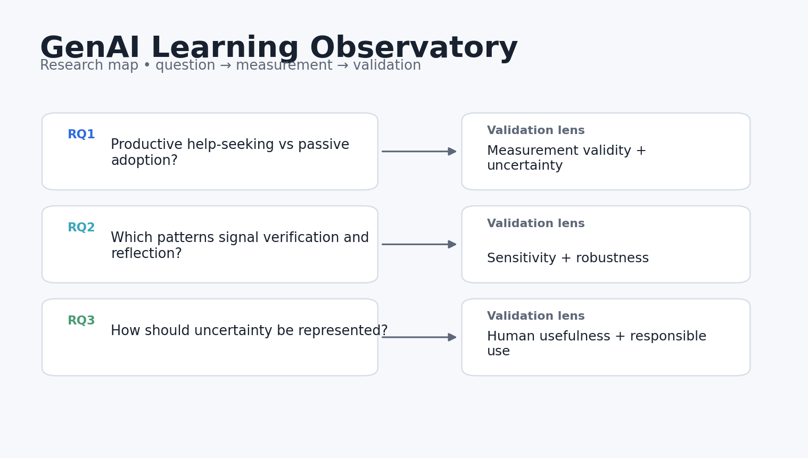

# GenAI Learning Observatory

**Observability for how learners actually use generative AI, not just whether they used it.**

> Research prototype. All bundled data and results are synthetic demonstrations. Nothing in this repository should be interpreted as evidence about real learners, teachers, or institutions.



## Why this project exists

Most dashboards reduce GenAI use to counts or time-on-task. This project treats learner–AI interaction as a process: what the learner asked for, whether they checked the answer, whether they revised it, and whether the interaction ended in reflection or simple adoption.

The engineering goal is simple: make the research logic inspectable. Every metric in the demo can be traced back to a small function, the demo data can be regenerated from a fixed seed, and the limitations are stated next to the claims rather than buried at the end.

## Research questions

1. How can we distinguish productive help-seeking from passive answer adoption?
2. Which interaction patterns signal learner agency, verification, and reflection?
3. How should an observability layer represent uncertainty without turning exploratory analytics into high-stakes labels?

## What the repository does



The reference pipeline follows five stages:

1. **Event ingestion**
2. **Intent tagging**
3. **Behavioral feature extraction**
4. **Session aggregation**
5. **Agency-oriented reporting**

The current implementation is deliberately compact enough to audit. It is a foundation for a real study, not a theatrical “AI demo.”

## Core outputs

- `verification_rate`
- `revision_rate`
- `reflection_rate`
- `answer_adoption_rate`
- `intent_diversity`
- `agency_index`



The dashboard above is generated from **synthetic data** and is included only to show what the analysis surface looks like. It is not a reported empirical result.

## Quick start

```bash
python -m venv .venv
source .venv/bin/activate  # Windows: .venv\Scripts\activate
pip install -e .[dev]
python examples/demo.py
pytest -q
```

You can also use Docker:

```bash
docker build -t genai_learning_observatory .
docker run --rm genai_learning_observatory
```

## Repository structure

```text
genai_learning_observatory/
├── src/genai_learning_observatory/        # core implementation and synthetic-data generator
├── examples/demo.py        # end-to-end reproducible demo
├── tests/                  # executable unit tests
├── docs/                   # research design, data dictionary, references
│   └── images/             # original project diagrams and demo visualisations
├── results/                # synthetic demo outputs only
├── config/default.yaml
├── Dockerfile
├── Makefile
└── pyproject.toml
```

## Research design in one picture



The fuller design rationale is in [`docs/research_design.md`](docs/research_design.md), including constructs, assumptions, validation steps, and a proposed empirical extension.

## Reproducibility choices

- Synthetic generation uses a fixed random seed.
- The core metrics are implemented as small, testable functions.
- The demo writes machine-readable results into `results/`.
- CI runs the tests on every push and pull request.
- No API keys, proprietary datasets, or external model calls are required for the baseline.

## Responsible-use boundaries

- Intent tagging is deliberately transparent and lightweight; it is not a validated psychological classifier.
- The included data are synthetic and cannot support claims about real learners.
- Agency-related features are descriptive research signals, not diagnostic labels or grading criteria.

## Strong next experiments

- Replace rule-based intent tagging with a validated transformer classifier and report calibration.
- Add sequence models for interaction trajectories rather than only session aggregates.
- Run a learner/teacher co-design study to test whether the dashboard supports useful reflection.

## References

See [`docs/references.md`](docs/references.md). The references are there to locate the project in current AIED, learning-analytics, human-centered AI, and instructional-design research. They do **not** imply endorsement or affiliation.

## Citation

If you build on this research prototype, use the metadata in [`CITATION.cff`](CITATION.cff).

## License

MIT for the code in this repository. Research data from future studies should use a separate data-governance and consent process.
